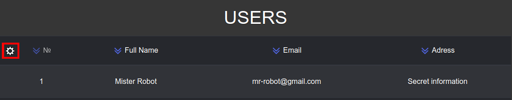
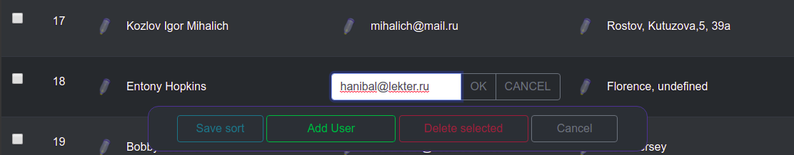

# Задание:
Необходимо написать небольшую систему администрирования таблицы mysql.
Для примера взять таблицу "пользователей" с полями: ФИО, E-mail, Адрес.
Система администрирования должна иметь авторизацию. Тип авторизации - серверная.
После авторизации выдаётся таблица с пользователями. Есть кнопка Добавить нового пользователя.
В каждой строке, напротив данных пользователя есть ссылка Изменить и чекбокс для удаления пользователей.
Под таблицей кнопка Удалить, по нажатию на которую удаляются все отмеченные пользователи.
Добавление и изменение информации делается с помощью ajax.

Не обязательно, но желательно:
1. В столбцы таблицы встроить возможность сортировки таблицы, также ajax.
2. Сортировка строк может производиться методом drag-and-drop, то есть цепляем мышкой строку, перетаскиваем в нужное место и сортировка строк меняется.

## Комментарий к решению:
Есть 2 режима: просмотр и редактирование записей.
Переход в режим редактирования осуществляется по клику на шестеренку, а выход по клику по кнопке "cancel".

В режиме редактирования возможно:
- изменение записей по клику на карандаш;
- удаление выделенных чекбоксом записей;
- создание новых записей;
- создание новых сортировок. После изменения порядка записей (методом drag-and-drop) активируется кнопка "Save sort", которая позволяет сохранить новую сортировку.

## Логин и пароль админа: 
maxiMir 
fsocial

